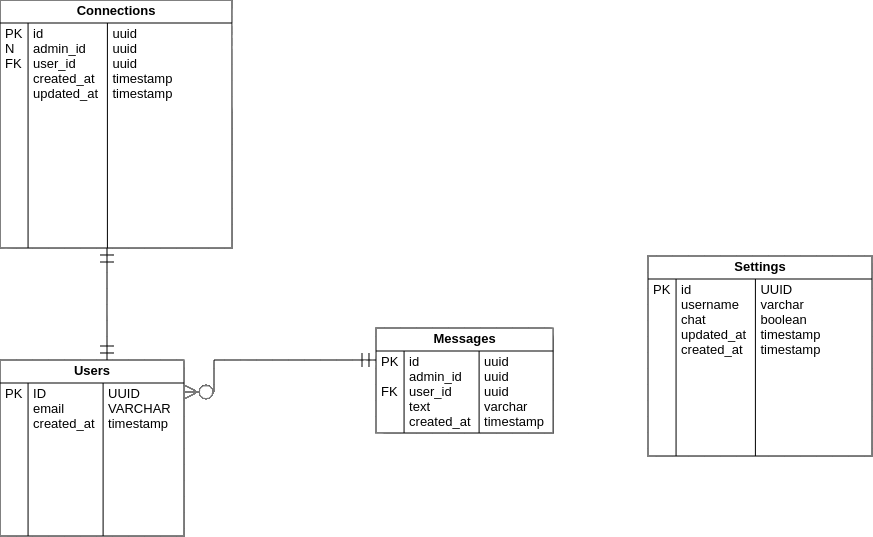

<h1 align="center">
  
</h1>

<p align="center">
  <a href="#projeto">Sobre a aplicação</a>&nbsp;&nbsp;&nbsp;|&nbsp;&nbsp;&nbsp;
  <a href="#tecs">Tecnologias</a>&nbsp;&nbsp;&nbsp;|&nbsp;&nbsp;&nbsp;
  <a href="#requisitos">Como rodar</a>&nbsp;&nbsp;&nbsp;|&nbsp;&nbsp;&nbsp;
  <a href="#rotas">Rotas</a>&nbsp;&nbsp;&nbsp;|&nbsp;&nbsp;&nbsp;
  <a href="#licenca">Licença</a>&nbsp;&nbsp;&nbsp;|&nbsp;&nbsp;&nbsp;
  <a href="#dev">Dev</a>
</p>

<div id="projeto">
  
# :bookmark_tabs: Projeto
Este é um serviço de "suporte ao cliente", que consiste no desenvolvimento de um widget de chat de mensagens instantâneas, que possibilita conversas entre um atendente e clientes cadastrados. Este projeto foi construído na trilha de Node.js durante a Next Level Week #05 (evento oferecido pela RocketSeat).
- Abaixo é possível observar o Diagrama de Entidade e Relacionamento em que o projeto foi baseado, onde há 4 tabelas: uma para usuários, uma para mensagens, uma para conexões e outra de configurações.

<p align="center">
  
</p>

</div>

<div id="tecs">

# :hammer_and_wrench: Tecnologias

As seguintes tecnologias e ferramentas estão sendo utilizadas neste projeto:

- TypeScript
- NodeJS
- Express
- SQLite
- Insomnia
- Web Socket

</div>

<div id="requisitos">

# :gear: Como rodar

Antes de começar, você vai precisar ter instalado algumas coisinhas, como o Node.js e o Yarn, é só seguir esse passo a passo [aqui](https://www.notion.so/Instala-o-das-ferramentas-405f3e8b014649cbb422dee6b5bd0535). Tenha também o [Git](https://git-scm.com/), para clonar este repositório!

```bash
# Clone esse repositório
$ git clone https://github.com/MariaGabrielaReis/nlw-05-support-chat.git

# Acesse a pasta src
$ cd src

# Instale as dependências do projeto, assim como suas tipagens
$ yarn

# Para criar o banco de dados e suas tabelas, rode as migrations
$ yarn typeorm migration:run

# Execute a aplicação
$ yarn dev

# O servidor inciará na porta:3333 - acesse http://localhost:3333
# Para utilizar as funcionalidades da aplicação, use o Insomnia para simular requisições e respostas das rotas
```

</div>

<div id="layout">
  
# :railway_track: Rotas

#### GET

- http://localhost:3333/messages/:id (lista mensagens enviadas ou recebidas por um usuário)
- http://localhost:3333/settings/:username (lista as configurações de um determinado usuário)

#### POST

- http://localhost:3333/settings (cria instância na tabela "Settings")
- http://localhost:3333/users (cria um usuário)
- http://localhost:3333/messages (salva uma mensagem)

#### PUT

- http://localhost:3333/settings/:username (atualiza dados das configurações de um determinado usuário)

</div>

<div id="licenca">

# :page_with_curl: Licença

Esse projeto está sob a licença MIT. Veja o arquivo [LICENSE](LICENSE) para mais detalhes.

</div>

<div id="dev">

> Maria Gabriela Reis, 2021 :sparkles: <br>
> ❤️ [Github](https://github.com/MariaGabrielaReis)<br>
> 💙 [Linkedin](https://www.linkedin.com/in/mariagabrielareis/)<br>
> 💜 [Rocketseat](https://app.rocketseat.com.br/me/mariagabrielareis)

</div>
